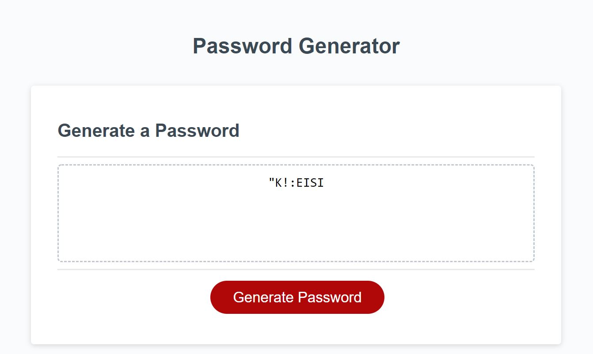

# Safe Password

Webpage deployed link: https://andrev96.github.io/03_Password_Generator_AVL/

GitHub link: https://github.com/AndreV96/Safe_Password

The Purpose of this Webpage is to practice all that was learned in Module 3 of JavaScript by creating a webpage that generates a random password based on the user's selected criteria. The Webpage must be able to generate a random password that has uppercase letters, lowercase letters, numbers, special characters or a combination of these with an specific characters length, all determined by the user. Also, it will only create a password if it validates certain criteria which is that the length selected by the user must be greater or equal than 8 and equal or lower than 128 and it must have at least one character type attributed. If the user selects an option that does not meet any of the criteria, a message should appear explaining the mistake to the user, but no errors should appear in any case. 

The webpage only consists of a heading with the title of the tool and a box containing a space where the password appears once it has been generated and it has the generate password button. When the button is clicked all window prompts and confirms appear so the user can select the desired attributes and length for the password. Once all the window options have been selected the new randomly generated password appears so the user can copy it.

Screenshot of deployed Webpage:  
